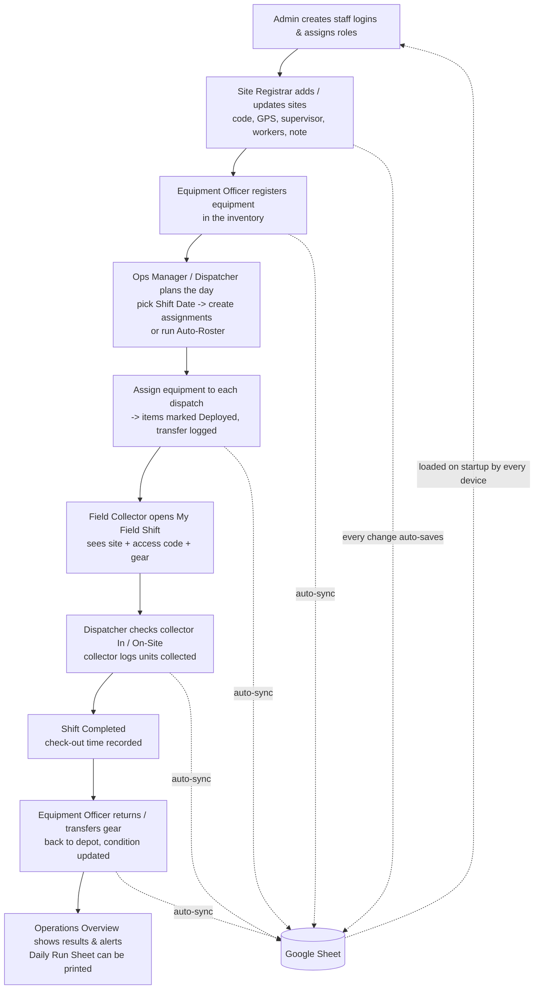

<div align="center">

</div>

# Run and deploy your AI Studio app

This contains everything you need to run your app locally.

View your app in AI Studio: https://ai.studio/apps/158fbd3c-b710-4984-993a-7406d7405700

## Run Locally

**Prerequisites:**  Node.js


1. Install dependencies:
   `npm install`
2. Set the `GEMINI_API_KEY` in [.env.local](.env.local) to your Gemini API key
3. Run the app:
   `npm run dev`

The app is served at `http://localhost:3000` and on your local network at
`http://<your-computer-ip>:3000` (other devices on the same Wi‑Fi can open it).

---

# Site & Inventory Manager

A field‑operations app for running multiple survey/collection **sites**: the people
(**collectors**), the daily **assignments/dispatch**, and the **equipment** that moves
between the depot and the field. All data lives in **one shared Google Sheet** so every
device sees the same records.

## How the data works (Google Sheet = database)

- A small **Google Apps Script** ([`apps-script/Code.gs`](apps-script/Code.gs)) is deployed
  from the Sheet as a Web App. Setup steps: [`apps-script/README.md`](apps-script/README.md).
- The app is pre‑configured with that Web App URL + token, so **every browser/device
  connects automatically** — no Google sign‑in for staff.
- On startup the app **loads all data from the Sheet**. Every change you make in the app
  (add a site, dispatch a collector, transfer equipment, …) is **written back to the Sheet
  automatically** within ~2 seconds.
- The Sheet has one readable tab per collection (`Sites`, `Collectors`, `Assignments`,
  `Equipment`, `Transfers`, `Users`) plus a hidden `_raw` tab that holds the authoritative
  copy. **Edit data through the app, not by typing in the tabs.**
- Manual **Push / Pull** buttons are in the **Sheets Sync** dialog if you ever need them.

```
 App (any device) ──auto‑push on every edit──▶  Apps Script Web App ──▶  Google Sheet
        ▲                                                                     │
        └──────────────── auto‑pull on startup / "Pull from Sheet" ───────────┘
```

## Logging in & roles

Everyone signs in with an in‑app **Login ID + password** (managed by an Admin under
**Manage IDs & Roles**). This is separate from Google. What each role sees:

| Role | Purpose | Tabs they get |
| --- | --- | --- |
| **Admin** | Full control: create staff logins, set passwords, assign roles, manage everything, configure Sheet sync. | Operations Overview, Sites & Arrangements, Daily Dispatch, Equipment Inventory, Collectors Team |
| **Operations Manager** | Same operational view as Admin (all sites/rosters/equipment) but no user management. | Operations Overview, Sites & Arrangements, Daily Dispatch, Equipment Inventory, Collectors Team |
| **Site Registrar** | One job: find, add and update **site details** (name, GPS, supervisor, worker count, note). All edits auto‑save to the Sheet. | Sites & Details only |
| **Site Dispatcher** | Runs the daily field dispatch: check collectors in/out, schedule shifts, print run‑sheets. Scoped to sites they dispatch / are assigned to. | Daily Dispatch, Sites & Access |
| **Equipment Officer** | Manages the equipment inventory: condition, calibration, and custody transfers between depot / sites / collectors. Scoped to items they handle. | Equipment Inventory |
| **Field Collector** | Personal shift view: today's site, gate/access code, and logging units collected. Scoped to their own assignments. | My Field Shift |

## What each tab means

- **Operations Overview** — dashboard: active sites, staff deployed today, equipment in
  the field, and operational alerts (overdue calibration, unstaffed sites, etc.).
- **Sites & Arrangements / Sites & Details / Sites & Access** — the list of field sites.
  Add / edit a site (code auto‑generated, name, latitude‑longitude with a "use current
  location" button, supervisor name + contact, number of workers, a free‑text note),
  search and filter by status/region, and expand a row to see full details.
- **Daily Dispatch** — the assignments for the selected **Shift Date** (top of the screen).
  Create an assignment (site + collector + shift + equipment), move it through
  Scheduled → Dispatched → On‑Site → Completed, record check‑in/out times and units
  collected. **Auto‑Roster** auto‑matches available collectors to active sites.
- **Equipment Inventory** — every asset, its status (Available / Deployed / Maintenance),
  condition, storage location and calibration dates. **Transfer** an item to a site or
  collector or back to the depot; each transfer is logged.
- **Collectors Team** — the field workforce roster: contact info, certifications, assigned
  vehicle, daily capacity, and who is on shift.
- **My Field Shift** (Field Collector only) — today's assigned site, access code, assigned
  equipment, and a counter to log completed units.
- **Daily Run Sheet** (button) — a printable manifest of the day's dispatches.
- **Sheets Sync** (button, Admin / Ops Manager / Site Registrar) — connection status,
  auto‑sync toggle, and manual Push / Pull.

## Typical workflow



Plain-text version of the same flow:

```
1. Admin        ->  create staff Login IDs + assign roles
2. Site Registrar ->  add / update sites (name, GPS, supervisor, workers, note)
3. Equipment Officer ->  register equipment into the inventory
4. Ops Manager / Dispatcher ->  choose Shift Date, create daily assignments (or Auto-Roster)
5. Dispatcher   ->  attach equipment to each assignment  (equipment becomes "Deployed")
6. Field Collector ->  open "My Field Shift": site, access code, assigned gear
7. Dispatcher   ->  check collector In / On-Site;  collector logs units collected
8. Shift done   ->  status Completed, check-out time saved
9. Equipment Officer ->  return / transfer gear to depot, update condition
10. Overview tab ->  review alerts & totals;  print the Daily Run Sheet

Every step above writes to the shared Google Sheet automatically; every device
reloads from that Sheet on startup.
```
