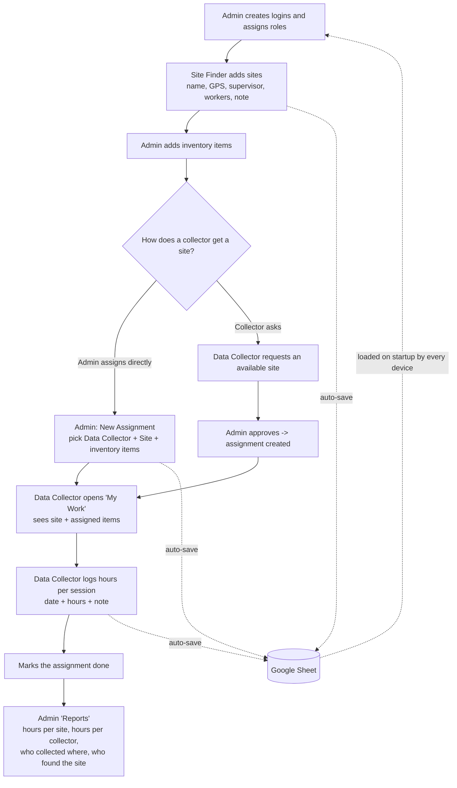

<div align="center">

</div>

# Run and deploy your AI Studio app

This contains everything you need to run your app locally.

View your app in AI Studio: https://ai.studio/apps/158fbd3c-b710-4984-993a-7406d7405700

## Run Locally

**Prerequisites:**  Node.js

1. Install dependencies:
   `npm install`
2. Run the app:
   `npm run dev`

The app is served at `http://localhost:3000` and on your local network at
`http://<your-computer-ip>:3000` (other devices on the same Wi‑Fi can open it).

Live (GitHub Pages): **https://roshan-khatiwada-official.github.io/Site_and_Inventor_Management/**

---

# Site & Inventory Manager

A small field-operations app. **Site Finders** add field sites, **Data Collectors**
request sites and log how many hours of data they collect, and the **Admin** manages
the inventory, assigns collectors to sites (with inventory items), approves requests,
and reads the reports. All data is stored in **one shared Google Sheet**.

## Roles

| Role | Can do | Sees |
| --- | --- | --- |
| **Admin** | Manage inventory; assign a data collector to a site and hand them inventory items; approve/reject site requests; manage logins; read all reports. | Everything |
| **Site Finder** | Add / edit field sites (name, GPS with "use current location", supervisor + contact, number of workers, a note). | **Only the sites they added** |
| **Data Collector** | Browse available sites and request the ones they want; on their assignments, log collection hours (date + hours + optional note) and mark the site done. | **Only their own** requests and assignments, plus the public list of available sites |

Everyone signs in with an in-app **Login ID + password** (created by the Admin under
**Logins**). This is not a Google login.

## The tabs

**Admin**
- **Sites** — every site, and which Site Finder added it. Add / edit / delete.
- **Inventory** — simple item list (Item ID, Name, Category, Quantity, Note). Add / edit / delete.
- **Assignments** — assign a Data Collector to a Site and tick the inventory items they take. Shows hours logged per assignment.
- **Requests** — data collectors' requests for available sites. **Approve** creates an assignment (and marks the site *Assigned*); **Reject** dismisses it.
- **Reports** — the numbers (see below).
- **Logins** — create / edit / suspend / delete user logins and set their role.

**Site Finder**
- **My Sites** — add and manage the sites you found. New sites start as *Available*.

**Data Collector**
- **Available Sites** — every *Available* site, with a **Request** button. Shows your request status.
- **My Work** — your assignments. For each: the site, the inventory items you were given,
  and a form to **log hours** (date + hours + note). Sessions add up into a total. Mark it done when finished.

## Reports (Admin)

- **Totals:** number of Data Collectors, number of Sites, total hours logged, number of Site Finders.
- **Collection log:** one row per assignment — Data Collector · Site · Found by · Hours · Sessions · Status. Filter by collector, by site, or free-text search.
- **Total hours per site** (+ who found it, + which collectors worked it).
- **Total hours per data collector** (+ how many sites).

## How the data is stored (Google Sheet = database)

- A **Google Apps Script** ([`apps-script/Code.gs`](apps-script/Code.gs)) is deployed from
  the Sheet as a Web App. Setup / redeploy steps: [`apps-script/README.md`](apps-script/README.md).
- The Web App URL + token are built into the app, so **every device connects automatically** —
  no Google sign-in for staff.
- The app **loads from the Sheet on startup** and **writes every change back automatically**
  (~2 s later). One readable tab per collection (`Sites`, `Inventory`, `Assignments`,
  `Requests`, `Users`) plus a hidden `_raw` tab that holds the authoritative copy.
  **Edit data through the app, not by typing in the tabs.**

```
 App (any device) ──auto-save on every edit──▶  Apps Script Web App ──▶  Google Sheet
        ▲                                                                     │
        └──────────────── auto-load on startup / manual "pull" ───────────────┘
```

## Typical workflow



Plain-text version:

```
1. Admin           -> create Login IDs + roles (Admin / Site Finder / Data Collector)
2. Site Finder     -> add sites (name, GPS, supervisor, workers, note)  [status: Available]
3. Admin           -> add inventory items (Item ID, Name, ...)
4a. Admin          -> New Assignment: choose Data Collector + Site + inventory items
4b. or Data Collector -> request an Available site  ->  Admin approves  ->  assignment created
5. Data Collector  -> "My Work": see the site + items; log hours (date + hours + note) per session
6. Data Collector  -> mark the assignment Done
7. Admin           -> "Reports": total hours per site / per collector, who collected where,
                      and which Site Finder found each site

Every step auto-saves to the shared Google Sheet; every device loads from it on startup.
```
